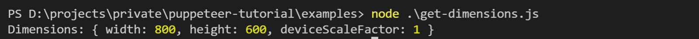

# Puppeteer 是什么

Puppeteer 是一个 Node library，提供了一套完整的通过 [DevTools 协议](https://chromedevtools.github.io/devtools-protocol/)操纵 Chrome 或 Chromium 的 API。Puppeteer 默认以 [无头（headless）](https://developers.google.com/web/updates/2017/04/headless-chrome) 的方式运行, 也可以使用 GUI 的方式运行 Chrome 和 Chromium。

熟悉爬虫或者 UI 自动化的同学可能会联想到 [PhantomJS](https://phantomjs.org/)、[CasperJS](https://www.casperjs.org/) 或者 [Selenium](https://www.selenium.dev/)，而作为 Chrome DevTools 团队亲自出品和维护的 puppeteer 不管是在功能的完整性、稳定性、兼容性、安全性还是性能都将成为碾压其他工具的存在。

## Puppeteer 的作用

理论上我们在 Chrome 里能做的事情，通过 puppeteer 都能够做到。比如：

- 对页面和元素截图
- 把页面保存为 PDF
- 爬取 SPA（Single-Page Application）网站的内容并为 SSR（Server-Side Rendering）网站生成 pre-render 的内容
- UI 自动化测试、自动填充/提交表单、模拟 UI 输入
- 测试最新的 Javascript 和 Chrome 功能
- 性能测试，生成 [timeline trace](https://developer.chrome.com/docs/devtools/evaluate-performance/reference/) 用于定位网站性能问题
- 测试 Chrome 的插件

当然，puppeteer 也不是全能的，比如在跨浏览器兼容方面就有所欠缺，目前只对 Firefox 做了实验性的支持，所以要对网站做浏览器兼容性测试还是得选择 Selenium/WebDriver 之类的工具，puppeteer 更多的是专注于和 Chromium 的互通，以提供更丰富更可靠的功能。

# 安装 Puppeteer

```shell
npm i puppeteer
```

或

```shell
yarn add puppeteer
```

> 安装 puppeteer 的过程中会下载最新版本的 Chromiun (~170MB Mac, ~282MB Linux, ~280MB Win)，以确保最新版的 puppeteer 和 Chromium 完全兼容. 我们也可以跳过 Chromium 的下载，或者下载其他版本的 Chromium 到特定路径，这些都可以通过环境变量进行配置，具体参考 [Environment variables](https://github.com/puppeteer/puppeteer/blob/v10.4.0/docs/api.md#environment-variables).

## puppeteer-core

`puppeteer-core` 是 puppeteer 的一个轻量版本，不会默认下载 Chromium，而是需要选择使用本地或远程的 Chrome。

```shell
npm i puppeteer-core
```

或

```shell
yarn add puppeteer-core
```

> 使用 `puppeteer-core` 需要确保它的版本和连接的 Chrome 版本可以兼容。

> `puppeteer-core` 会忽略所有的 PUPPETEER\_\* 环境变量

关于 puppeteer 和 puppeteer-core 的详细对比请参考：[puppeteer vs puppeteer-core](https://github.com/puppeteer/puppeteer/blob/main/docs/api.md#puppeteer-vs-puppeteer-core)。

# 用法举例

#### **示例 1** - 访问 https://example.com 并对网页截图

创建 **screenshot.js**

```js
const puppeteer = require("puppeteer");

(async () => {
  const browser = await puppeteer.launch();
  const page = await browser.newPage();
  await page.goto("https://example.com");
  await page.screenshot({ path: "example.png" });

  await browser.close();
})();
```

执行 **screenshot.js**

```shell
node screenshot.js
```

生成图片预览：


Puppeteer 初始的窗口尺寸为 800x600px, 这也决定了对页面的截图的尺寸为 800x600px。我们可以使用 [Page.setViewport()](https://github.com/puppeteer/puppeteer/blob/v10.4.0/docs/api.md#pagesetviewportviewport) 对窗口尺寸进行设置，比如设置成 1080P 的：

```js
page.setViewport({
  width: 1920,
  height: 1080,
});
```

如果想要对真个网页进行滚动截图，可以使用:

```js
await page.screenshot({ fullPage: true });
```

#### **示例 2** - 访问 https://github.com/puppeteer/puppeteer 并将网页保存为 PDF 文件。

创建 **savePDF.js**

```js
const puppeteer = require("puppeteer");

(async () => {
  const browser = await puppeteer.launch();
  const page = await browser.newPage();
  page.setViewport({
    width: 1920,
    height: 1080,
  });
  await page.goto("https://github.com/puppeteer/puppeteer", {
    waitUntil: "networkidle2",
  });
  await page.pdf({
    path: "puppeteer.pdf",
    format: "a2",
  });

  await browser.close();
})();
```

执行 **savePDF.js**

```shell
node savePDF.js
```

生成的 PDF 预览：


生成 PDF 的更多选项请参考：[Page.pdf()](https://github.com/puppeteer/puppeteer/blob/v10.4.0/docs/api.md#pagepdfoptions) 。

#### **示例 3** - 在浏览器的上下文中执行 JS 代码

创建 **get-dimensions.js**

```js
const puppeteer = require("puppeteer");

(async () => {
  const browser = await puppeteer.launch();
  const page = await browser.newPage();
  await page.goto("https://example.com");

  // Get the "viewport" of the page, as reported by the page.
  const dimensions = await page.evaluate(() => {
    return {
      width: document.documentElement.clientWidth,
      height: document.documentElement.clientHeight,
      deviceScaleFactor: window.devicePixelRatio,
    };
  });

  console.log("Dimensions:", dimensions);

  await browser.close();
})();
```

执行 **get-dimensions.js**

```shell
node get-dimensions.js
```

执行结果：



更多 `evaluate` 的用法请参考 [Page.evaluate()](https://github.com/puppeteer/puppeteer/blob/v10.4.0/docs/api.md#pageevaluatepagefunction-args)。

#### **示例 4** - 自动填充表单并提交（在 https://developers.google.com 页面搜索框中输入关键词 `Headless Chrome` 并搜索）

创建 **search.js**

```js
const puppeteer = require("puppeteer");

(async () => {
  const browser = await puppeteer.launch({
    headless: false, // GUI模式
  });
  const page = await browser.newPage();
  await page.goto("https://developers.google.com/web/");
  // 在搜索框中输入关键词
  await page.type(".devsite-search-field", "Headless Chrome");
  // 按Enter键
  await page.keyboard.press("Enter");
  // 等待结果返回
  const resultsSelector = ".gsc-result .gs-title";
  await page.waitForSelector(resultsSelector);
  // 从页面中爬取结果
  const links = await page.evaluate((resultsSelector) => {
    const anchors = Array.from(document.querySelectorAll(resultsSelector));
    return anchors.map((anchor) => {
      const title = anchor.textContent.split("|")[0].trim();
      return `${title} - ${anchor.href}`;
    });
  }, resultsSelector);
  // 打印结果
  console.log(links.join("\n"));

  await browser.close();
})();
```

执行 **search.js**

```shell
node search.js
```

结果展示：


# Debugging 技巧

Puppeteer 在 debugging 层面非常强大，下面罗列了一些常用的技巧。

### 1. 关闭“无头”模式 - 看到浏览器的显示内容对调试很有帮助

```js
const browser = await puppeteer.launch({ headless: false });
```

### 2. 打开“慢动作”模式 - 进一步看清浏览器的运行

```js
const browser = await puppeteer.launch({
  headless: false,
  slowMo: 250, // 将puppeteer的操作减慢250ms
});
```

### 3. 监听浏览器控制台中的输出

```js
page.on("console", (msg) => console.log("PAGE LOG:", msg.text()));

await page.evaluate(() => console.log(`url is ${location.href}`));
```

### 4. 在浏览器执行代码中使用 debugger

目前有两种执行上下文：运行测试代码的 node.js 上下文和运行被测试代码的浏览器上下文，我们可以使用 `page.evaluate()` 在浏览器上下文中插入 debugger 进行调试：

- 首先在启动 puppeteer 的时候设置 `{devtools: true}`：

  ```js
  const browser = await puppeteer.launch({ devtools: true });
  ```

- 然后在 `evaluate()` 的执行代码中插入 `debugger`，这样 Chromium 在执行到这一步的时候会停止：

  ```js
  await page.evaluate(() => {
    debugger;
  });
  ```

### 5. 启用详细日志记录（verbose loggin） - 内部 DevTools 协议流量将通过 puppeteer 命名空间下的[debug 模块](https://github.com/visionmedia/debug)记录

**基本用法：**

```shell
DEBUG=puppeteer:* node screenshot.js
```

Windows 下面可以使用[cross-env](https://www.npmjs.com/package/cross-env)

```shell
npx cross-env DEBUG=puppeteer:* node screenshot.js
```

**协议流量可能相当复杂，我们可以过滤掉所有网络域消息**

```shell
env DEBUG=puppeteer:\* env DEBUG_COLORS=true node ./examples/screenshot.js 2>&1 | grep -v '"Network'
```

### 6. 使用 ndb 工具进行调试，具体用法请参考 [ndb](https://github.com/GoogleChromeLabs/ndb)

# 资源链接

1. [Puppeteer 官网](https://pptr.dev/)
1. [API 文档](https://github.com/puppeteer/puppeteer/blob/v11.0.0/docs/api.md)
1. [使用示例](https://github.com/puppeteer/puppeteer/tree/main/examples/)
1. [Github - Awesome Puppeteer](https://github.com/transitive-bullshit/awesome-puppeteer)
1. [Troubleshooting](https://github.com/puppeteer/puppeteer/blob/main/docs/troubleshooting.md)

本文 Demo 链接：https://github.com/MudOnTire/puppeteer-tutorial
